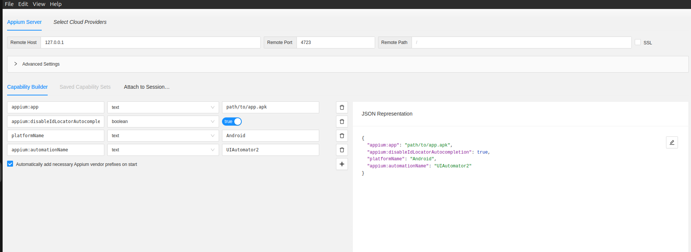
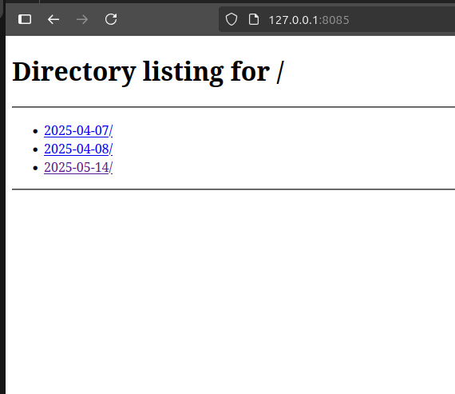
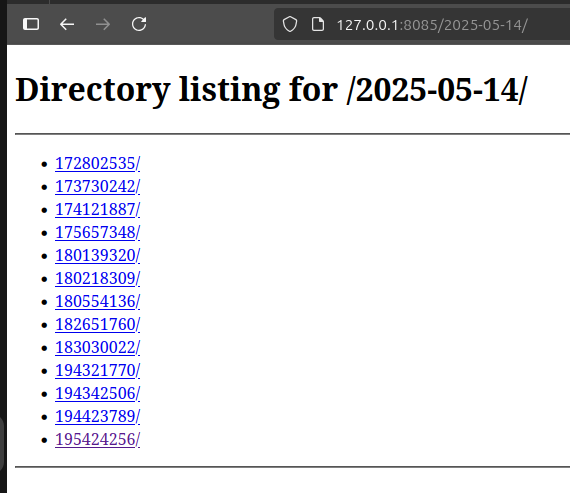
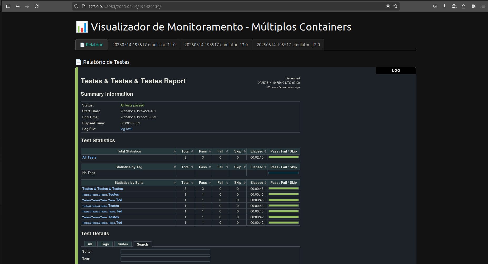
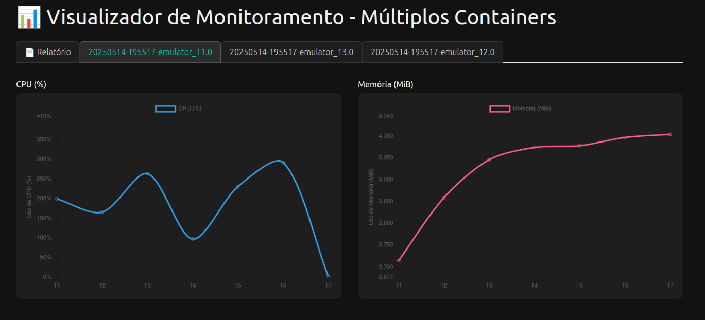

# Informações relevantes
### Projeto de exemplo para um ambiente de teste baseado em appium e robot-framework

Para inspecionar, julgaremos que ja possui um device disponivel no adb, na porta 4723.

Para execução, o projeto possui um arquivo devices/devices.yml, onde mapeamos os devices que estarão sendo executados via docker. Nele definimos variavies que serão usadas para executar os testes em cada um dos containers.
Ao executar  o arquivo run_testes.py, o arquivo devices.yml será lido e então serão criados arquivos .args que por sua vez serão usados pelo pabot para criar as instancias e executar em paralelo. Isso é necessário pois o base.resource do robot espera receber os valores via variaveis de ambiente.

As informações devem ser iguais as do docker-compose.yml, isto é, as informaçoes do container deverão ser inseridas no device.yml conforme o valor esperado.

Para aumentar ou diminuir a quantidade de containers docker, altere tanto o arquivo de devices.yml quanto o docker-compose.yml.

Para alterar a versão do android do container, consultar primeiramente o docker hub, buscando pelo dono da imagem.


## Inspecionar
### Pré requisitos
- Possua um device disponivel na porta 4723
- Instale o appium
```bash
sudo apt install -y curl nodejs npm openjdk-11-jdk git unzip
npm install -g appium
```
- Baixe o appium inspector
    - https://github.com/appium/appium-inspector/releases/tag/v2025.3.1

- Instale o UIAutomator2

```bash
appium driver install uiautomator2
```
### Para inspencionar
#### Tenha as variaveis de ambiente corretas
```bash
export ANDROID_HOME=$HOME/Android/Sdk
export ANDROID_SDK_ROOT=$HOME/Android/Sdk
export PATH=$PATH:$ANDROID_HOME/platform-tools
export PATH=$PATH:$ANDROID_HOME/emulator
```
#### Inicie o server appium
```bash
appium
```

#### Inicie o appium inspector
```bash
./Appium-Inspector-2025.3.1-linux-x86_64.AppImage 
```

#### Configure o capability builder ou json representation

```json
{
  "appium:app": "path/to/app.apk",
  "appium:disableIdLocatorAutocompletion": true,
  "platformName": "Android",
  "appium:automationName": "UIAutomator2"
}
```


#### E por fim inicie a sessão.

## Docker
Para rodar via docker, iniciaremos os containers
```bash
docker compose up -d
```

Depois verificar manualmente se os devices estão disponiveis (Essa validação será adicionada ao script futuramente)
```bash
docker exec -it emulator_13.0 adb devices
docker exec -it emulator_12.0 adb devices
docker exec -it emulator_11.0 adb devices
```

Todos os devices estando online, executaremos o script para rodar os testes
```bash
python3 run_testes.py
```
Apos a execução, inicie um servidor local em python
```bash
python -m http.server 8085 -d logs/  # ou outra porta
```
### Acesse: http://localhost:8085

### Navegue entre as pastas pela data



### Navegue entre as pastas pelo horario



### Verifique o resultado do teste, da mesma forma que veria pelo robot



### Verifique o consumo de recursos por container (baseado em um processador de 4 nucleos)



